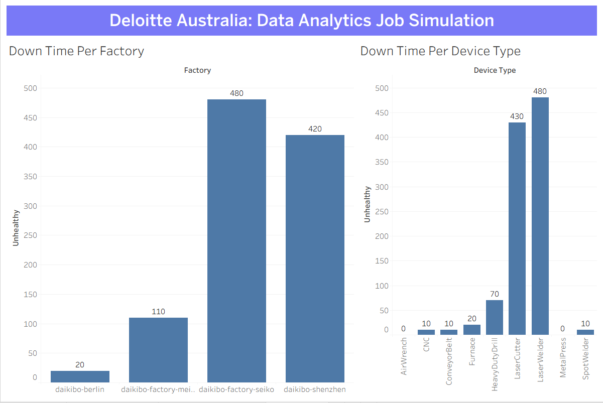

# Deloitte Australia: Data Analytics Job Simulation

## 📊 Project Overview

Completed the **Deloitte Australia Data Analytics Job Simulation on Forage**, gaining practical experience in data analysis, data visualization, and communicating business insights.

The project involved analyzing telemetry data from multiple factories to identify machine health patterns and operational insights.

## 🛠️ Tools & Technologies

- Tableau
- Excel
- Data Analysis
- Data Visualization
- Calculated Fields
- Dashboard Development

## 📌 Dataset

The dataset contained **160,704 telemetry records** collected from four factories:

- Tokyo
- Osaka
- Berlin
- Shenzhen

The data covered **9 different machine types**, with telemetry messages recorded every 10 minutes during May 2021.

## 🔍 Analysis Performed

The analysis focused on:

- Machine health across different factories
- Machine types and operational status
- Unhealthy machine conditions
- Factory-level performance
- Machine downtime patterns
- Identification of operational insights

## 📈 Key Analysis

Created a calculated measure called **Unhealthy** to identify unhealthy machine conditions and analyzed machine performance across different factories and machine types using Tableau.

## 💡 Key Insights

- Analyzed **160,704 telemetry records** across four factories.
- Compared machine health across **Tokyo, Osaka, Berlin, and Shenzhen**.
- Analyzed the performance of **9 different machine types**.
- Identified unhealthy machine conditions using a calculated measure.
- Used data visualization to identify machine health and operational patterns.

## 📊 Live Tableau Dashboard

👉 **[View Live Dashboard](https://public.tableau.com/app/profile/arlin.soniya.d/viz/DeloitteAustraliaDataAnalyticsJobSimulation_17864593875800/Dashboard1)**

## 🖼️ Dashboard Preview

## 📁 Project Files

- `Deloitte Data Analytics Dashboard.twbx` – Tableau workbook containing the analysis and dashboard.
- `Dashboard.png` – Dashboard preview image.

## 🎯 Project Objective

The objective of this simulation was to analyze telemetry data, identify machine health patterns, and communicate meaningful insights through data visualization.

## 📚 Experience

This simulation provided practical exposure to a real-world data analytics workflow, including data analysis, visualization, calculated fields, and communicating business insights.
